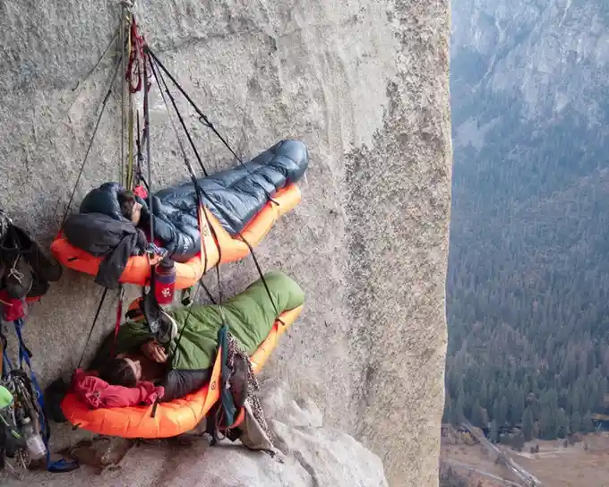

## 9/27/2025 - Quixotic
/kwɪkˈsɑdɪk/ kwick-SAH-dick or /kiˈ(h)oʊdɪk/ kee-HOH-dick

Idealistic to the point of impracticality, foolish pursuit of ideas.

> From Don Quixote
> And it's a fun linguistic twist that we say Don Keehotee but don't say Quihotic

-- <cite>Daniel</cite>

---

## 8/15/2025 - Bivouac 
/ˈbɪv(ə)ˌwæk/ BIV-uh-wack

Improvised temporary shelter often associated with mountain climbers and soldiers.

> Magic taught me this one. Great word

-- <cite>Alex</cite>

---

## 8/6/2025 **MINI** - Imperious
/ᵻmˈpɪriəs/ uhm-PEER-ee-uhss

Arrogant/Domineering

---

## 7/29/2025 - Laudanum
/ˈlɔdn̩əm/ LAW-duhn-uhm or /ˈlɑdn̩əm/ LAH-duhn-uhm

A mixture of opium and alcohol, used in Victorian era as a
readily available pain-killer and sedative pre-aspirin.
Commonly associated with the romantic poets of the time due
to a handful of high-profile artists being addicted

> Thats the shit thats in amnesia

-- <cite>Yves</cite>

> I also learned this from amnesia lol

-- <cite>Evan</cite>

> Oh shit I have a bag of milky ways

-- <cite>Derek</cite>

---

## 6/31/2025 ***Yves BONUS*** - Careworn

Tired and unhappy because of prolonged worry.

> i think maybe i've never been not carewarn

-- <cite>Kaylee</cite>

> Real
> Worry warts of the world unite
> And then maybe take a nap

-- <cite>Evan</cite>

---

## 6/15/2025 - Sophistry
/ˈsɒfɪstri/ SOFF-uh-stree

The use of clever but false arguments, deceptive reasoning
or arguments.

---

## 5/14/2025 - Inimical 
/ᵻˈnɪmək(ə)l/ uh-NIM-uh-kuhl

Obstructs or harms, hostile in effect

> Eg. "Favreau's leadership is inimical to making good Star
> Wars."

---

## 5/1/2025 ***Andrew BONUS*** - fridge

> "His wife got fridged so hard it almost gave him superpowers" - context I heard it in

-- <cite>Andrew</cite>

---

## 4/30/2025 ***Kaylee's Humble submission for KWotD Consideration*** - Obsequious
Obedient or attentive to an excessive or servile degree.

> I bet that new obsequious mode in ChatGPT is really fun when you're having a manic episode.

> Pls understand this is a heavily second rate facsimile of the actual thing. 
> An homage to the clearly superior original.
> I stumbled upon this word and it was too good not to share.

-- <cite>Kaylee</cite>

> bein kinda obsequious rn

-- <cite>Daniel</cite>

> Get it together Daniel

-- <cite>Yves</cite>

---

## 4/27/2025 - Abnegate 
/ˈæbnəˌɡeɪt/ AB-nuh-gayt

Renounce or reject, relinquish something of value.

> fuk u mean halk

-- <cite>Kebin</cite>

> relinquish

-- <cite>Daniel</cite>

> FUCK

-- <cite>Kebin</cite>

---

## 4/4/2025 - Saprophytic 
/ˈsæp.rə.faɪt/ SA-pro-phy-TIC

Obtaining nutrients from dead matter, fungus, feasting on
decay.

> guy at the car place points out like 4 identical dings on both sides of my backdoors and says "That happens when people open your door into yours when you're parked"
> i do the calculations in my head, to ding my backdoor they are opening their backdoor
> its gotta be the saprophytic trampolene kids just swinging open their doors and bashing mine

-- <cite>Andrew</cite>

---

## 4/3/2025 - Immiseration
/ɪˌmɪzərʌɪˈzeɪʃən/ im-iz-uh-righ-ZAY-shuhn

To make miserable, usually in an economic sense.

> Eg. "The immoderation of the working class."
> 
> fuck

-- <cite>Kebin</cite>

---

## 2/5/2025 - Irascible
/ᵻˈræsəbəl/ uh-RASS-uh-buhl

Hot temper, easily provoked, irritable.

## 1/30/2025 - Crepuscular
/krɪˈpʌskjuːlə/ kruh-PUH-skyuh-lr

Of or relating to twilight, active during twilight (commonly
used describing animal behavior).

> lets go
> inspired by my dance certainly

-- <cite>Andrew</cite>

---

## 1/15/2025 - Peripatetic
/ˌpɛrəpəˈtɛdɪk/ pair-uh-puh-TED-ik

Relating to walking, moving or traveling from place to
place, nomadic.

> Your never gonna believe that im currently doing book
> editing and i needed an exact word like this

-- <cite>Yves</cite>

---

## 1/7/2025 - Perspicacious 
/ˌpərspəˈkeɪʃəs/ purr-spuh-KAY-shuhss

Having keen mental perception, understanding, discerning,
quick to understand, shrewd.

> Just when you thought it might be a bad day we get a KWotD

-- <cite>Jonjo</cite>

---

## 1/3/2025 - Mendacious
/mɛnˈdeɪʃəs/ men-DAY-shuhss

Falsehood, deception, not being truthful.

> He told mendacious stories of victories in battle.

---

## 12/15/2024 Derek's ***Question of the Moon***
What game had the tightest grip on your life at some point?

> Pre-release gw2 or league i think

-- <cite>Jonjo</cite>

> Either release sc2 or class 2019

-- <cite>Daniel</cite>

> Planetside 2 was the first game I was fully bought in to
> the hype cycle, was farming beta keys through social media
> with my friends over one summer break

-- <cite>Kebin</cite>

---

## 12/5/2024 - Peregrination 
/ˌpɛrəɡrəˈneɪʃən/ pair-uh-gruh-NAY-shuhn

Long journey traveled to various places, usually on foot,
pilgrimage.

---

## 12/1/2024 - Diaphanous
/daɪˈæfənəs/ digh-AFF-uh-nuhss

Transparent, ethereal, delicate, commonly used in respect to
fabric.

---

## 11/27/2024 - Ebulience (sp?)
/ɪˈbʌlɪəns/ uh-BUL-ee-uhns

The quality of lively or enthusiastic expression,
exuberance.

> just heard the word "ebullient"
> potential kevin word of the day here
> i like the way it sounds

-- <cite>Andrew Three Months Later</cite>

> Really imagining us all crawling towards the throne that is Kevin's Word of the Day with our pitiful literary tributes
> cut down in our insolance the executioner whispers a single phrase before our deaths:
> "I already knew that word"

-- <cite>Evan Also Three Months Later</cite>

---

## 11/14/2024 - Masticate
/ˈmæstəˌkeɪt/ MASS-tuh-kayt

To chew; munch

> I first learned that word by reading My Immortal, the hp fanfic) 

-- <cite>Yves</cite>

> literally the same

-- <cite>Andrew</cite>

## 11/14/2024 ***Daniel Bonus*** - Sitzpinkler
/ˈzɪt͡sˌpɪŋklɐ/

A man who pees sitting down.

> This cannot be real.

-- <cite>Kebin</cite>

---

## 11/13/2024 - Dilettante
/ˈdɪləˌtɑnt/ DIL-uh-tahnt or /ˈdɪləˌtænt/ DIL-uh-tant

A person having superficial interest in an art or branch of
knowledge, a dabbler.

## 11/13/2024 ***BONUS*** - Debutante
/debytɑ̃t/ deh-BYOO-taant

An aristocratic girl who has reached marriage-age and is ready to “debut” to society.

> From this [*Oingo Bingo* song](https://open.spotify.com/track/0XNEpHNJRXrJ3skacHgcFa?si=KUTxPR0DQv2PGqBKumwsNA).

---

## 11/11/2024 - Sybarite
/ˈsɪbəˌraɪt/ SIB-uh-right

Person who is self-indulgent in their fondness for sensuous
luxury.

> Sybarite is a cool word that sounds like a rock 

-- <cite>Derek</cite>

---

## 10/31/2024 - Ineffable
/ɪnˈɛfəb(ə)l/ in-EFF-uh-buhl

Too great or extreme to be described with words,
unspeakable, incapable of being expressed.

---

## 10/29/2024 - Extant
/ˈɛkstənt/ EK-stuhnt or /ɛkˈstænt/ ek-STANT

Currently or actually existing, still existing, not
destroyed or lost.

---

## 10/28/2024 - Acerbic
/əˈsərbɪk/ uh-SURR-bick

Sharply or bitingly critical, sarcastic, ironic in temper
mood or tone.

> More than the content, it was the acerbic nature of Kevin's 
> Oldhead reviews that cemented him a place at the annual Hater's Ball

---

## 10/15/2024 - Perfidy 
/ˈpərfədi/ PURR-fuh-dee

Deceitfulness; untrustworthiness

---
